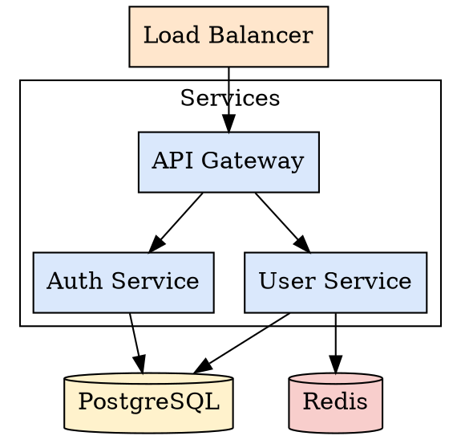
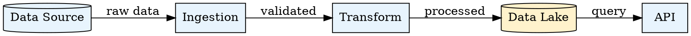

# Lucid Diagram

## Overview

This skill creates technical diagrams by generating Graphviz DOT files and converting them to:
1. **PNG image** - For embedding in documentation and READMEs
2. **Lucid Chart compatible XML** - For importing into Lucid Chart for further editing

## Output Location

The output location is flexible and should be determined based on user preference or project conventions:

- **User-specified path**: If the user requests a specific location, use that
- **Project conventions**: Check for existing diagram directories (`docs/diagrams/`, `assets/`, `images/`, etc.)
- **Default suggestion**: If no preference exists, suggest `docs/diagrams/` as a reasonable default

**Always ask or confirm the output location before generating diagrams.**

## Supported Diagram Types

### Architecture Diagrams
System components, services, databases, APIs, and their connections. Use `digraph` with boxes for services, cylinders for databases, and arrows for connections.

### Data Flow Diagrams
How data moves through systems and processes. Use directional edges with labels describing the data being transferred.

### Sequence Diagrams
Interactions between components over time. Use subgraphs to group related components and numbered edges to show order.

## Workflow

### Step 1: Analyze Requirements

Determine what the user wants to diagram:
- If diagramming from code: Explore the codebase to understand the architecture, services, and data flow
- If diagramming a concept: Clarify the components and relationships with the user

### Step 2: Determine Output Location

Ask the user where they want the diagram files, or check for existing conventions:

```bash
# Check for existing diagram directories
ls -d docs/diagrams assets/diagrams images diagrams 2>/dev/null
```

If none exist, suggest a location and confirm with the user.

### Step 3: Generate the DOT File

Create a `.dot` file with a descriptive filename in the chosen location.

**Directory Setup:**
```bash
mkdir -p <output_directory>
```

**DOT File Structure:**


### Step 4: Convert to PNG and Lucid Chart Format

Run the conversion script to generate both the PNG image and XML file:

```bash
python3 <skill_path>/scripts/convert_to_lucid.py <output_directory>/<filename>.dot
```

This produces:
- `<output_directory>/<filename>.png` - PNG image for documentation
- `<output_directory>/<filename>.xml` - Lucid Chart compatible XML

**Custom output path:**
```bash
python3 <skill_path>/scripts/convert_to_lucid.py input.dot /custom/path/output.xml
```

**Requirements:**
- Graphviz must be installed for PNG generation (`brew install graphviz` on macOS)
- graphviz2drawio is auto-installed for XML generation

### Step 5: Provide Output Instructions

After generating the files, instruct the user:

**For PNG:**
- The PNG can be embedded in README or documentation files
- Reference it with: ``

**For Lucid Chart:**
1. Open Lucid Chart
2. Go to File > Import
3. Select the generated `.xml` file
4. The diagram will appear and can be edited further

## Lucid Chart Compatibility

**Important:** Not all Graphviz features translate perfectly to Lucid Chart. The conversion uses `graphviz2drawio` which has limitations.

### Shapes That Work Well
| Shape | Lucid Chart Result |
|-------|-------------------|
| `box` | Rectangle with label preserved |
| `ellipse` | Oval with label preserved |
| `cylinder` | Database cylinder with label preserved |
| `folder` | Folder shape with label preserved |

### Shapes to Avoid
| Shape | Issue |
|-------|-------|
| `component` | Label is replaced with generic "Component" text |
| `house` | May not render correctly |
| `cloud` | May lose label or render incorrectly |
| `note` | May not translate |

**Recommendation:** Use `box` with `style="filled,rounded"` for most components. Use descriptive labels instead of relying on shape semantics.

### Edge Styling
**Important:** Always set explicit edge colors. Without explicit colors, edges may import as white/invisible in Lucid Chart.

```dot
edge [color="#333333", penwidth=1.5];  // Set globally for all edges
```

### Known Lucid Chart Limitations
- Edge label text will have white background boxes (this is a Lucid Chart import limitation, not fixable from DOT)
- You may need to manually adjust label backgrounds in Lucid Chart after import

### Other Limitations
- Complex HTML labels may not translate fully
- Some edge routing options (like `splines=ortho`) may be ignored
- Custom fonts may fall back to defaults

## DOT Syntax Reference

For detailed Graphviz syntax including node shapes, edge styles, subgraphs, and styling options, read:
`<skill_path>/references/graphviz_syntax.md`

## Common Patterns

### Microservices Architecture


### Data Pipeline


## Resources

### scripts/
- `convert_to_lucid.py` - Converts DOT files to PNG images and Lucid Chart compatible XML

### references/
- `graphviz_syntax.md` - Complete Graphviz DOT language reference with examples
