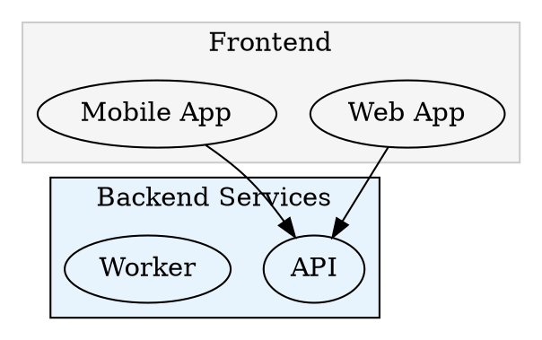
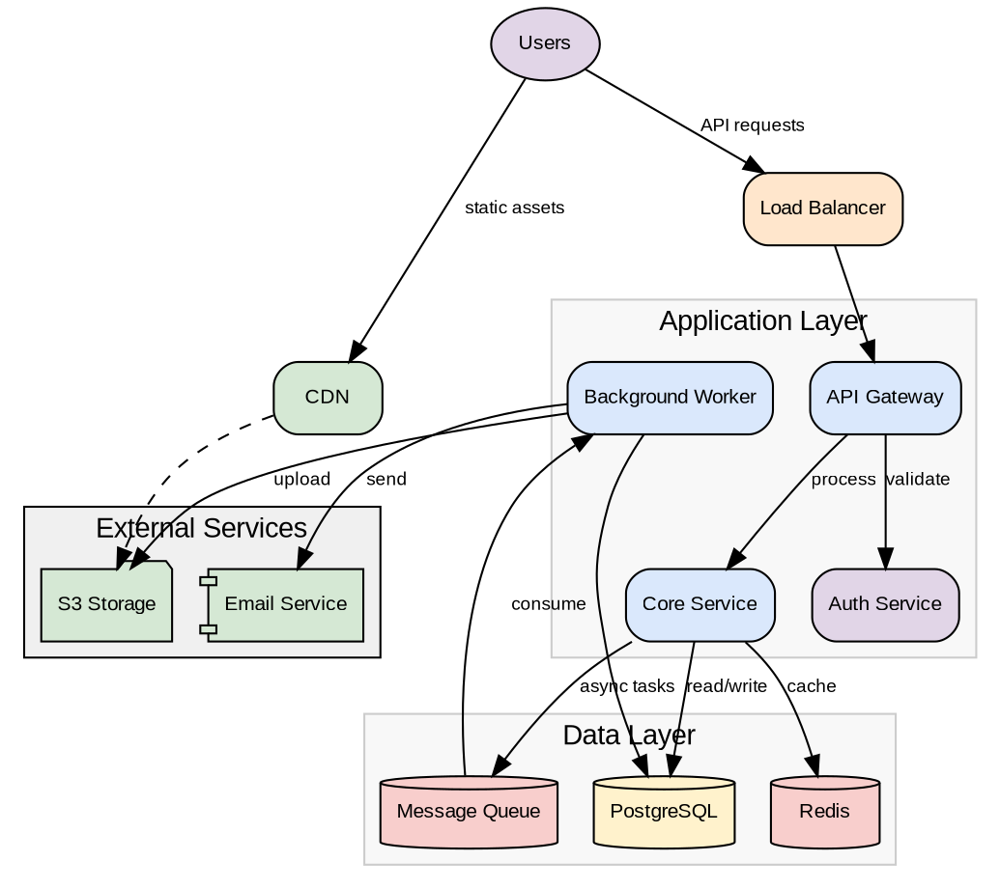

# Graphviz DOT Language Reference

## Basic Structure

```dot
digraph GraphName {
    // Directed graph (use arrows)
}

graph GraphName {
    // Undirected graph (use lines)
}
```

## Graph Attributes

```dot
digraph G {
    // Layout direction
    rankdir=LR;    // Left to Right
    rankdir=TB;    // Top to Bottom (default)
    rankdir=RL;    // Right to Left
    rankdir=BT;    // Bottom to Top

    // Spacing
    nodesep=0.5;   // Horizontal spacing between nodes
    ranksep=0.5;   // Vertical spacing between ranks

    // Background
    bgcolor="#FFFFFF";

    // Font
    fontname="Arial";
    fontsize=12;
}
```

## Node Shapes

Common shapes for architecture diagrams:

| Shape | Use Case | Lucid Chart Compatible |
|-------|----------|------------------------|
| `box` | Services, components, applications | Yes |
| `cylinder` | Databases, data stores | Yes |
| `ellipse` | Start/end points, general nodes | Yes |
| `diamond` | Decision points | Yes |
| `folder` | File systems, directories | Yes |
| `note` | Documentation, comments | No - may not translate |
| `cloud` | External services, internet | No - may lose labels |
| `component` | Software components | No - labels lost |
| `house` | Entry points, gateways | No - may not render |
| `parallelogram` | Input/output | Partial |

**Note:** For Lucid Chart export, prefer `box`, `cylinder`, `ellipse`, and `folder` shapes. Other shapes may lose their labels or render incorrectly.

```dot
node1 [shape=box];
node2 [shape=cylinder];
node3 [shape=ellipse];
node4 [shape=diamond];
node5 [shape=folder];
```

## Node Styling

```dot
node [
    shape=box,
    style=filled,
    fillcolor="#E8F4FD",
    color="#333333",         // Border color
    fontcolor="#000000",
    fontname="Arial",
    fontsize=10,
    width=1.5,
    height=0.5
];

// Individual node styling
api [label="API Gateway", fillcolor="#DAE8FC", style="filled,rounded"];
```

### Style Options
- `filled` - Fill with color
- `rounded` - Rounded corners
- `dashed` - Dashed border
- `dotted` - Dotted border
- `bold` - Bold border
- `invis` - Invisible (for layout)

Combine styles: `style="filled,rounded,dashed"`

## Edge Styling

```dot
A -> B [
    label="request",
    color="#666666",
    fontcolor="#333333",
    style=dashed,
    arrowhead=vee,
    arrowtail=none,
    penwidth=2
];
```

### Arrow Styles
- `normal` - Standard arrow
- `vee` - V-shaped
- `dot` - Filled circle
- `odot` - Open circle
- `diamond` - Diamond shape
- `box` - Square
- `none` - No arrow

### Edge Styles
- `solid` - Solid line (default)
- `dashed` - Dashed line
- `dotted` - Dotted line
- `bold` - Thick line

## Subgraphs (Clusters)

Group related nodes:



Note: Cluster names must start with `cluster_` to be rendered as a box.

## Common Color Palettes

### Service Colors
```dot
// Blue - APIs and services
api [fillcolor="#DAE8FC"];

// Yellow/Orange - Databases
db [fillcolor="#FFF2CC"];

// Red/Pink - Cache, queues
cache [fillcolor="#F8CECC"];

// Green - External services
external [fillcolor="#D5E8D4"];

// Purple - Authentication
auth [fillcolor="#E1D5E7"];

// Gray - Infrastructure
infra [fillcolor="#F5F5F5"];
```

## Labels with HTML

For multi-line or formatted labels:

```dot
node [label=<
    <TABLE BORDER="0" CELLBORDER="0">
        <TR><TD><B>Service Name</B></TD></TR>
        <TR><TD><FONT POINT-SIZE="8">port: 8080</FONT></TD></TR>
    </TABLE>
>];
```

## Ports and Record Shapes

For nodes with multiple connection points:

```dot
struct [shape=record, label="{ <port1> Input | Process | <port2> Output }"];

A -> struct:port1;
struct:port2 -> B;
```

## Rank Control

Force nodes to be at the same level:

```dot
{ rank=same; node1; node2; node3; }

// Or
{ rank=min; startnode; }
{ rank=max; endnode; }
```

## Complete Architecture Example



## Tips for Clean Diagrams

1. **Use consistent colors** - Pick a palette and stick to it
2. **Group related nodes** - Use subgraphs/clusters
3. **Label edges** - Describe what flows between components
4. **Control direction** - Use `rankdir` to match mental model
5. **Minimize crossings** - Arrange nodes to reduce edge crossings
6. **Use invisible edges** - `style=invis` can help with layout without showing
